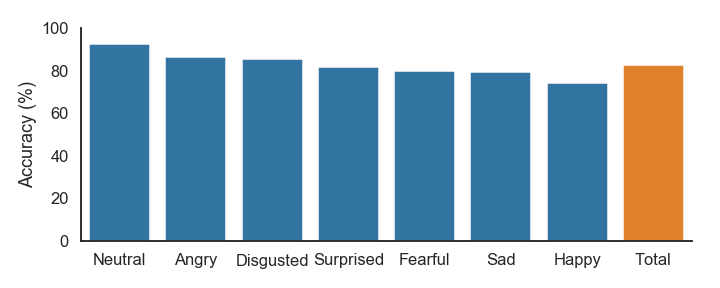

# Vocal Emotion Sensing

## Intro  
  
Human expression and communication is multi-faceted and complex. For example, a speaker
not only communicates through words, but also through cadence, intonation, facial
expressions, and body language. It's why we prefer to hold business meetings in person
rather than over conference calls, and why conference calls are preffered over emails or texting.
The closer we are the more communication bandwidth exists.

Voice recognition software has advanced greatly in recent years. This technology 
now does an excellent job of recognizing phoenetic sounds and piecing these together 
to reproduce spoken words and sentences. However, simply translating speech to text does not
fully encapsulate a speakers message. Facial expressions and body language aside, text 
is highly limited in its capacity to capture emotional intent. It's why sarcasm is so
difficult to capture on paper.  
  
This github repo contains code used to build, train, and test a convolutional neural network to
classify emotion in input audio files.  
  
## Data
  
Data for training and testing this classifier was obtained from three University compiled
datasets: RAVDESS, TESS, and SAVEE. In total these datasets provide > 4,000 labeled audio files
across 7 common emotional categories (neutral, happy, sad, angry, fearful, disgusted, surprised)
spoken by 30 actors. 
  
The RAVDESS audio files are easily available online in a single downloadable zip file.
The TESS files are also easily available but require some web-scraping and a `wget`
command. The SAVEE files require registration to access, anyone can easily register. 
Once registered the files can be easily downloaded via a single `wget` command.  

## Methods  
  
A number of preprocessing steps are required before audio files can be classified. Python's
Librosa library contains a number of excellent functions for performing these steps. The process
is essentially to load audio files into python, remove silent portions, create set length windows
of audio, then compute [MFCCs](https://en.wikipedia.org/wiki/Mel-frequency_cepstrum) for each window.
The actual classification is then performed on the windowed MFCCs.  
  
The file visualizing_and_cleaning_data.ipynb contains code used for EDA and noise floor detection.
  
Training data is generated by taking random windows from each file, for this project I used 0.4s windows.
The number of windows taken from each file is determined by the file's length. This training data is then
fed into a convolutional neural network.  
  
In order to make predictions on test files a similar process is used. The main difference is that
windows are taken from the test file in a sliding fashion, I used a 0.1s step size for my 0.4s windows.
Classification is then performed on every window, predictions are aggregated for all the windows,
and the final result is determined by choosing the class with the greatest aggregate prediction
strength.  
  
The file build_cnn.ipynb contains code used for generating training data, passing the training
data to a CNN, then making predictions on a test set of files.
  
## Results
  
The CNN was able to predict the emotion of the test set files with 83% accuracy. 
  

